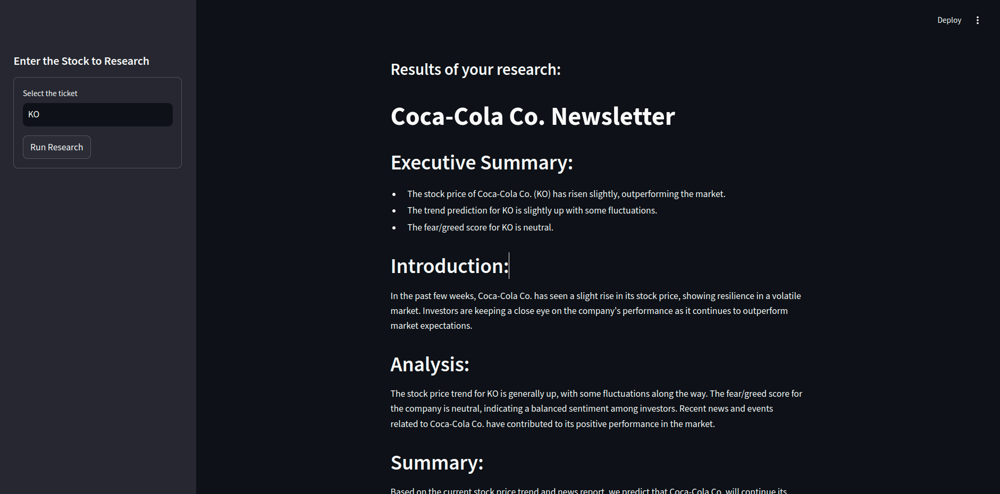

# 📈 Stock Analysis AI - Rocketseat "IA na Prática" Project

Este projeto foi desenvolvido durante o evento "IA na Prática" da Rocketseat e utiliza técnicas de Inteligência Artificial para análise de preços de ações, tendências de mercado e notícias relevantes. A aplicação combina várias ferramentas e bibliotecas para fornecer uma análise completa e automatizada do mercado financeiro.



## 🚀 Tecnologias Utilizadas

- **Python**: Linguagem de programação principal.
- **Streamlit**: Framework para criação rápida de interfaces web interativas.
- **yfinance**: Biblioteca para obter dados financeiros históricos e atuais de ações.
- **CrewAI**: Biblioteca para criação e gerenciamento de agentes de IA especializados em tarefas específicas.
- **Langchain**: Ferramenta para integração com modelos de linguagem avançados como o ChatGPT.
- **DuckDuckGo Search Results**: Utilizado para pesquisar notícias e informações relevantes na web.

## 📋 Funcionalidades

1. **Análise de Preços de Ações**: Utiliza a biblioteca `yfinance` para buscar e analisar o histórico de preços de uma ação específica.
   
2. **Agentes Inteligentes**:
   - **Stock Price Analyst**: Agente especializado em analisar os preços das ações e identificar tendências.
   - **Stock News Analyst**: Agente que busca e analisa notícias do mercado relacionadas à ação em questão, incluindo uma análise de sentimento (fear/greed).
   - **Stock Analyst Writer**: Agente que redige um boletim informativo baseado nas análises de preços e notícias.

3. **Boletim Informativo Automatizado**: Geração de um boletim informativo de três parágrafos que resume a análise da ação, incluindo tendências de preço, notícias relevantes e previsão de tendências futuras.

4. **Interface Web Interativa**: A aplicação permite que os usuários insiram um ticker de ação e recebam uma análise detalhada diretamente na interface web construída com Streamlit.

## 🛠️ Como Executar

1. Clone o repositório:
   ```bash
   git clone https://github.com/LuanPetruitis/stock-analysis-crewai.git
   cd stock-analysis-crewai
   ```

2. Instale as dependências:
   ```bash
   pip install -r requirements.txt
   ```

3. Execute a aplicação:
   ```bash
   streamlit run app.py
   ```

4. Insira o ticker de uma ação no campo indicado e clique em "Run Research" para gerar a análise.

## 📊 Exemplos de Uso

### Análise de Preços da AAPL (Apple Inc.)

```python
results = crew.kickoff(inputs={'ticket': 'AAPL'})
print(results.raw)
```

### Gerando um Boletim Informativo

O boletim gerado incluirá:

- **Resumo Executivo**: Pontos-chave da análise.
- **Introdução**: Visão geral do contexto do mercado.
- **Análise Principal**: Detalhamento das tendências de preço e notícias relevantes.
- **Conclusão**: Previsão de tendências futuras (alta, baixa ou estável).

## 🌐 Deploy

Para compartilhar sua aplicação com outras pessoas, você pode realizar o deploy facilmente usando o [Streamlit Share](https://share.streamlit.io/).

## 📚 Documentação

Para saber mais sobre as bibliotecas utilizadas, consulte a documentação oficial:
- [CrewAI Documentation](https://docs.crewai.com)
- [Streamlit Documentation](https://docs.streamlit.io)
- [Langchain Documentation](https://langchain.com)
- [yfinance Documentation](https://pypi.org/project/yfinance/)

## 🤝 Contribuição

Contribuições são bem-vindas! Sinta-se à vontade para abrir uma issue ou enviar um pull request.

---

Desenvolvido com 💻 durante o evento "IA na Prática" da Rocketseat.